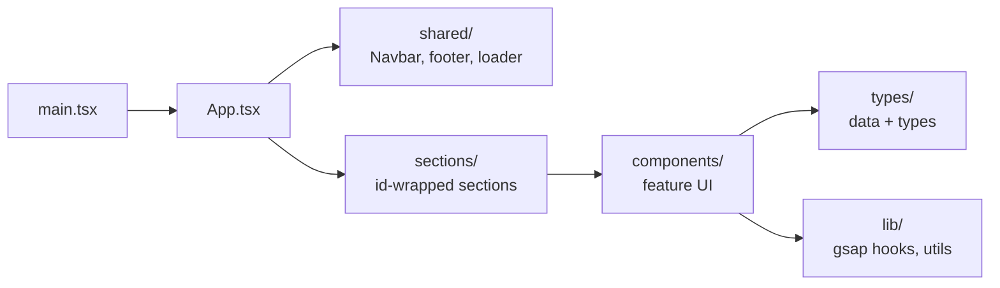
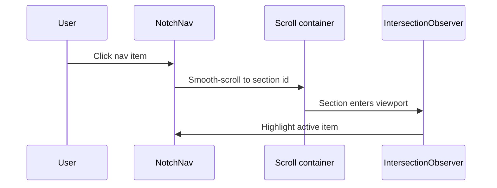

<div align="center">


<br />


<!-- Replace YOUR_USERNAME/finora-platform with your repo path -->


</div>

---

## Table of Contents

- [Overview](#overview)
- [Preview](#preview)
- [Tech Stack](#tech-stack)
- [Getting Started](#getting-started)
- [Project Structure](#project-structure)
- [Navigation & Scrolling](#navigation--scrolling)
- [Animation System](#animation-system)
- [Sections](#sections)

---

## Overview

Finora Platform is a landing/marketing single-page app built with **React, TypeScript, Vite and Tailwind CSS v4**. The page is a single scrollable view with a notch-style navigation bar that scrolls to each section. It opens on a full-bleed cinematic hero and is wrapped in a scroll-linked animation system.

## Preview

<div align="center">

<!-- Add your screenshots to docs/screenshots/ and update the file names below -->


<br /><br />

<table>
  <tr>
    <td align="center"><br /><sub><b>Features</b></sub></td>
    <td align="center"><br /><sub><b>Testimonials</b></sub></td>
  </tr>
  <tr>
    <td align="center"><br /><sub><b>Social Proof</b></sub></td>
    <td align="center"><br /><sub><b>FAQ</b></sub></td>
  </tr>
</table>


</div>

## Tech Stack

<div align="center">

[](https://skillicons.dev)

</div>

| Area | Technology |
| --- | --- |
| Framework | React 19 + TypeScript |
| Build tool | Vite (dev server, build, HMR) |
| Styling | Tailwind CSS v4 (CSS-first config via `@tailwindcss/vite`) |
| Scroll animation | GSAP + ScrollTrigger: scroll-linked cinematic/parallax animations |
| UI primitives | Radix UI (accordion, avatar, slot) |
| Motion / icons | framer-motion (notch nav layout), lucide-react (icons) |
| Physics / vector | matter-js (floating folder), lottie-react |
| Charts | recharts |
| Linting | Oxlint |

## Getting Started

```bash
npm install
npm run dev
```

| Script | Description |
| --- | --- |
| `npm run dev` | Start the Vite dev server |
| `npm run build` | Type-check and build for production |
| `npm run preview` | Preview the production build |
| `npm run lint` | Run Oxlint |

## Project Structure

The project separates concerns across four main folders. The `@` alias points to `src`.



```
src/
├── components/        UI building blocks, grouped by feature
│   ├── hero/          Full-bleed hero (headline, character, floating cards, CTA)
│   ├── faq/           Accordion, avatar, button, support card, Faq
│   ├── features/      Features grid, Card, FolderFloat (physics)
│   ├── social-proof/  Two-direction logo marquee
│   ├── testimonial/   Stagger testimonial carousel + Card
│   └── ui/            Shared widgets (notch-nav, AnimatedSection, Parallax, FoldText)
├── sections/          Page sections that wrap feature components with an id
│   ├── hero/          <section id="home"> (full-bleed)
│   ├── faq/           <section id="faq">
│   ├── features/      <section id="features">
│   ├── social-proof/  <section id="social-proof">
│   └── testimonial/   <section id="testimonials">
├── shared/            Cross-cutting pieces (header/Navbar, footer, loader, splash)
├── types/             Shared types and hardcoded data, grouped by feature
│   ├── faq/           FAQ categories, support avatars, types
│   ├── features/      Avatar/people data + types
│   ├── nav-items/     Navbar items
│   ├── notch-nav/     Notch nav types
│   ├── social-proof/  Brand/logo data
│   └── testimonial/   Testimonial data + types
├── lib/
│   ├── utils.ts       `cn` class-merge helper
│   ├── gsap.ts        Animation hooks (reveal, draw, count-up, scan, cinematic, parallax)
│   └── scroll-context.tsx  Provides the scroll container to animation hooks
├── App.tsx
├── main.tsx
└── index.css          Tailwind entry + theme tokens + all keyframes/animation CSS
```

### Conventions

- Feature components live in `src/components/<feature>/`.
- Page-level section wrappers live in `src/sections/<feature>/` and carry the `id` the nav scrolls to.
- Hardcoded data and shared types go in `src/types/<feature>/`.
- Theme colors are defined as CSS variables in `src/index.css` and exposed to Tailwind via `@theme inline`. Most global keyframes and animation CSS live in `index.css`; the self-contained `FolderFloat.css` and `FoldText.css` are the only per-folder stylesheets.

## Navigation & Scrolling

`src/shared/header/Navbar.tsx` renders every section inside the `NotchNav` scroll container. Nav items (`src/types/nav-items`) map to section ids; clicking an item smooth-scrolls to it, and an `IntersectionObserver` highlights the active item while scrolling. The notch header itself animates in on mount.



## Animation System

Because the page scrolls inside a custom container (not the window), GSAP ScrollTrigger is pointed at that element via `ScrollProvider` / `useScroller`. Hooks in `src/lib/gsap.ts`:

| Hook | What it does |
| --- | --- |
| `useCinematic` | Scrubbed scale + rise + fade + blur as a section enters, a crisp hold while centered, then drift/shrink/blur as it leaves (reversible). Used by `AnimatedSection`. |
| `useParallax` | Moves layers at different rates for depth. Used by `Parallax`. |
| `useGsapReveal` | Staggered fade/slide reveal for grids and lists. |
| `useDrawPaths` | Animated SVG stroke drawing. |
| `useCountUp` | Number count-up on view. |
| `useScanLine` | Looping scan-line motion (fingerprint card). |

A standalone `FoldText` component (`components/ui/fold-text`) splits text into characters/words/lines and unfolds each as a 3D panel (mount, hover, scroll, or loop triggers). The hero uses it on mount for the headline.

## Sections

| Section | Description |
| --- | --- |
| **Hero** | A full-bleed section (`components/hero`) that breaks out of the scroll container's padding to span edge-to-edge. A sky background (`hero.webp`) is layered with a transparent character (`Character.webp`) sized responsively via CSS variables. On mount it plays a cinematic sequence: the headline folds in line by line (`FoldText`), then the subtitle, character, floating cards, and the Uiverse-style "Get Started" push button arrive in turn, all respecting `prefers-reduced-motion`. The floating cards are hidden on mobile without affecting the CTA position. |
| **Social proof** | Two logo marquees scrolling in opposite directions, pause on hover (`components/social-proof`). |
| **Features** | Animated grid: count-up, animated charts, a scanning fingerprint, and `FolderFloat`, a folder whose pills float out with matter-js physics and open when scrolled into view. |
| **Testimonials** | A staggered card carousel (`components/testimonial`) with chevron controls. |
| **FAQ** | A flat accordion plus a full-width support contact card (`components/faq`). |

> The how-it-works and about sections currently render placeholders.

---

<div align="center">


</div>